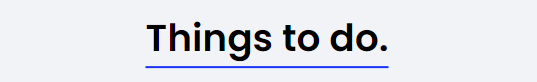

<h1 align="center">Vanilla JS를 이용한 Todo List 만들기</h1>
  

## 프로젝트 설명
텍스트 입력을 통해 동적으로 리스트를 추가하고 삭제해주는 미니 프로젝트입니다.

이 프로젝트는 드림코딩 아카데미 과정 중 하나로 **디자인 및 기능을 변형/확장한 버전**입니다.

## 사용기술

  
  

## 구현기능
- Enter 키를 통한 새 리스트 생성
- 완료된 리스트 체크
- 해당 리스트 삭제
- 리스트를 센터로 스크롤링
